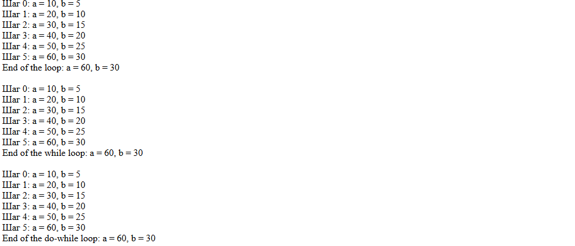

# Отчет по лабораторной работе

## Цель работы

Освоить использование условных конструкций и циклов в PHP.

## Задание 1: Условные конструкции

### Описание

Используя функцию `date()`, была создана таблица с расписанием, которое зависит от текущего дня недели.

- **Для John Styles**: Если текущий день — понедельник, среда или пятница, график работы: 8:00-12:00. В остальные дни недели — "Нерабочий день".
- **Для Jane Doe**: Если текущий день — вторник, четверг или суббота, график работы: 12:00-16:00. В остальные дни недели — "Нерабочий день".

### Код

```php
<?php

// Получаем текущий день недели
$dayOfWeek = date("l");
echo date("l");

// John Styles
$johnSchedule = "";
if ($dayOfWeek == "Monday" || $dayOfWeek == "Wednesday" || $dayOfWeek == "Friday") {
    $johnSchedule = "8:00 - 12:00";
} else {
    $johnSchedule = "Нерабочий день";
}

// Jane Doe
$janeSchedule = "";
if ($dayOfWeek == "Tuesday" || $dayOfWeek == "Thursday" || $dayOfWeek == "Saturday") {
    $janeSchedule = "12:00 - 16:00";
} else {
    $janeSchedule = "Нерабочий день";
}

// Вывод таблицы 
echo "<table border='1' style='border-collapse: collapse;'>
        <tr><th>№</th><th>Фамилия Имя</th><th>График работы</th></tr>
        <tr><td>1</td><td>John Styles</td><td>$johnSchedule</td></tr>
        <tr><td>2</td><td>Jane Doe</td><td>$janeSchedule</td></tr>
      </table>";
```


## Задание 2: Циклы

### Описание задачи

В этом задании нужно использовать три типа циклов  для изменения значений переменных `$a` и `$b`. На каждом шаге необходимо выводить промежуточные значения этих переменных.

### Программный код

```php
<?php

// Цикл for
$a = 0;
$b = 0;

for ($i = 0; $i <= 5; $i++) {
   $a += 10;
   $b += 5;
   echo "Шаг $i: a = $a, b = $b <br>";
}

echo "End of the loop: a = $a, b = $b <br>";

// Цикл while
$a = 0;
$b = 0;
$i = 0;
while ($i <= 5) {
   $a += 10;
   $b += 5;
   echo "Шаг $i: a = $a, b = $b <br>";
   $i++;
}

echo "End of the while loop: a = $a, b = $b <br>";

// Цикл do-while
$a = 0;
$b = 0;
$i = 0;
do {
   $a += 10;
   $b += 5;
   echo "Шаг $i: a = $a, b = $b <br>";
   $i++;
} while ($i <= 5);

echo "End of the do-while loop: a = $a, b = $b <br>";

?>
```

### Результат

При выполнении этих циклов будет выведено изменение значений переменных `$a` и `$b` на каждом шаге:

- В цикле `for` выводятся промежуточные значения на каждом шаге от 0 до 5.
- В цикле `while` выводятся аналогичные значения, но проверка условия происходит до тела цикла.
- В цикле `do-while` проверка условия осуществляется после выполнения тела цикла.



### Заключение

Выполнив это задание, были освоены различные виды циклов в PHP, и продемонстрировано, как они могут изменять значения переменных в процессе выполнения. Все циклы приводят к одному результату, но различаются по логике выполнения.
